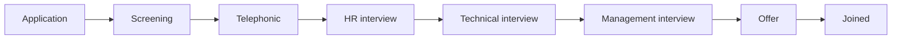

# Recruitment tracking and interview calendar plan

Draft: 10 October 2026. Based on the local recruitment QA report and current implementation.

## Goal

Give HR and management a reliable answer to four questions: which openings still need hires, where each candidate stands, which interviews need attention, and what action the current user can take next.

This is a proposed implementation plan. Permission changes, notifications and production data changes require their own explicit execution decisions.

## 1. Screen structure

### Recruitment workspace

Top navigation: **Openings · Candidates · History**. Preserve links into a specific opening or candidate and store filters in the URL.

Summary cards:

| Card | Exact meaning | Click destination |
| --- | --- | --- |
| Active openings | Nonterminal requisitions | Active openings filter |
| Remaining vacancies | Sum of max(total capacity − valid selections, 0) for active openings | Openings with remaining capacity |
| Interviews today | Scheduled, noncancelled appointments on the user's displayed date/timezone | Today agenda |
| Awaiting feedback | Completed interviews without submitted feedback | Feedback queue |

**Openings:** searchable list/table with title, department, location, total vacancies, filled, remaining, candidate count, owner, status and last activity. Expand or open a row to see its candidates. Offer a compact card layout on mobile. New/Edit Requisition forms include inline validation and clear capacity rules.

**Opening detail:** header with capacity progress, requisition description, owner and status; tabs for Candidates, Interviews and Activity. Candidate pipeline counts link to filtered candidates. Show why an opening is closed and whether it was automatic or manual.

**Candidates:** searchable register with name, opening, current stage, candidate outcome, next interview, assigned interviewer and next action. Filters: opening, department, stage, outcome, interviewer and date range. Counts always reflect the full filtered dataset, not one page.

**History:** closed openings plus rejected, withdrawn and completed candidate records. Keep filters and detail views available. Authorized restore/reopen actions require a reason and must respect vacancy capacity.

### Candidate detail

Open a right-side detail panel on desktop and a full-screen detail page on mobile. Give it a stable URL so refresh, browser Back and sharing internally work.

Header: candidate name, opening, current stage and outcome. Primary action reflects the next allowed action, such as Schedule interview, Submit feedback or Manage offer.

Tabs:

1. **Overview:** contact information, application source, experience, qualifications and resume where supported. Salary information is visible only with restricted-data permission.
2. **Interviews:** separate records for every round, each with date/time, duration, timezone, interviewer/panel, venue/link, appointment status, outcome and feedback.
3. **Evaluation:** screening notes and submitted interview evaluations. Label author and submission time; distinguish draft from final feedback. Do not present a missing score as zero.
4. **Offer:** release, acceptance/decline, salary, offer date, planned joining date and joining outcome. Restrict salary and decision actions by permission.
5. **Activity:** chronological changes with actor, time and reason. Display human-readable changes; keep private values masked for users without permission.

Use one candidate view from the opening register, calendar, dashboard and history so the same record always shows consistent information.

## 2. Interview calendar

Views: **Agenda · Week · Month**. Agenda is the mobile default; Week is the desktop default. Remember the user's last choice.

Header: Today, previous/next range, visible date range, view switch and Schedule interview. Filters: opening, interviewer/panel, round and appointment status. Provide an explicit displayed timezone, initially Asia/Kolkata for this portal.

Each appointment shows candidate, opening, round, start/end time, interviewer and status. Color identifies appointment status, with a text label and icon so color is never the only signal.

Clicking an appointment opens interview details with candidate link, panel, venue/link and permitted actions:

- Reschedule with reason; preserve previous schedule in history.
- Cancel with reason; cancellation does not reject the candidate.
- Mark completed or no-show.
- Enter/save feedback, then submit it.
- Advance the candidate after a submitted round outcome.

Scheduling form:

- Candidate and opening; round; date; start time; duration; timezone; panel; mode; venue or meeting link.
- Show candidate/interviewer conflicts before submission and enforce the same check server-side.
- Block overlapping active appointments by default. An explicit authorized override records a reason.
- Warn about past dates; allow authorized historical entry rather than silently prohibiting it.
- Notification controls must clearly show recipients and whether a notice will be sent. Until delivery is implemented and verified, show schedule saved without claiming an invitation was sent.

Empty states distinguish no appointments on this date from no results for these filters. API errors have Retry and preserve the current date/filters.

## 3. Workflow and accuracy rules

This is the default pipeline. Rejected, On hold and Withdrawn are outcomes, not interview rounds. Appointment states—Scheduled, Completed, Cancelled and No-show—are separate from candidate outcomes. An authorized stage skip requires a reason; do not create fictitious completed interviews for skipped stages.

### Vacancy rules

- Preserve the current business rule: selecting a candidate reserves one vacancy. A released/accepted offer continues that reservation; it does not reserve another vacancy.
- Close an opening automatically when valid selections reach its total capacity, even if offer/joining administration remains pending.
- Decline, withdrawal or reversal releases the reservation. Reopen an automatically filled opening if capacity becomes available; preserve manual closure.
- Increasing capacity can reopen automatic closure. Reducing capacity below reserved hires is rejected with a clear explanation.
- Manual closure/reopening requires a reason and explicit stored closure source. Do not rely on interpreting audit text for long-term lifecycle behavior.
- Dashboard, opening list and candidate detail use the same server-owned counts: total, filled/reserved and remaining.
- Moving a candidate to the Offer round alone must not issue an offer or imply acceptance.
- Completing an appointment does not automatically select a candidate. Replace ambiguous Mark Finish with Complete interview and a separate Next stage action.

### Feedback rules

Support draft and submitted feedback, configurable criteria, overall recommendation and comments. Do not invent score weights without a defined policy. Each round retains its own score and notes; advancing to a new stage never overwrites a previous evaluation. Correcting submitted feedback creates a revision with actor/reason.

## 4. Proposed role behavior

| Role | Working view | Actions, subject to configured permissions |
| --- | --- | --- |
| HR | Organization openings, candidates and scheduling queues | Requisitions, screening, scheduling, stage updates and offer administration |
| Manager/interviewer | Assigned interviews and authorized team openings | Own feedback and authorized hiring decisions; candidate/salary visibility checked separately |
| Management | Authorized hiring overview, vacancy progress and decisions | Selection/offer approvals only if explicitly granted |
| Admin | Configuration and organization view | Pipeline/permissions administration and audited overrides |
| Employee | No recruitment access by default | None unless specifically assigned an interviewer capability |

The existing system has a MANAGER role, not a separate MANAGEMENT role. Start with that role plus explicit capabilities and assignment scope. Do not add a new role until the organization confirms it is needed. The current supplied manager's read-only permissions remain the baseline; this plan does not authorize widening them.

Every restriction is enforced in the API as well as the UI. Restricted fields must be omitted from unauthorized API responses, not merely hidden in the browser.

## 5. Responsive and accessible UI

- Use the portal's existing colors, typography and components; keep status labels consistent across both modules.
- At narrow widths, convert registers to labeled candidate/opening cards. Keep critical fields and primary action visible without sideways scrolling.
- On desktop, use a table with stable column widths, wrapping for long names and paginated server results. Avoid turning entire interactive table rows into nested buttons/links.
- Forms use visible labels, keyboard-operable selects, associated inline errors and first-error focus.
- Detail panels/dialogs trap focus, close with Escape where safe and return focus to the originating control. Warn before discarding unsaved feedback.
- Loading skeletons preserve layout; refetching keeps existing results visible. Disable duplicate submissions and show progress on the relevant action.
- Filters support Clear all; retain search/date/page through navigation; reset to page one when filters change.
- Use explicit dates and timezone-aware times; show currency formatting and a meaningful Pending/Not provided state for missing values.
- Respect reduced motion. Test keyboard-only use and 200% zoom as well as small and large screens.

## 6. Data and API implementation

Introduce an **Interview** entity instead of repeatedly overwriting Candidate.interviewDate/interviewRound/interviewFeedback. Store candidate, round, start/end UTC, timezone, panel assignments, mode/location/link, appointment status and timestamps. Store feedback and its revisions per interview.

Keep current candidate fields temporarily for compatibility. Migrate a known existing scheduled interview to one legacy interview record. Do not infer past interviews or fabricate feedback from the current stage. Validate counts before enabling the new readers, then retire duplicated schedule fields through a separate migration.

Add explicit candidate stage/outcome, offer lifecycle, requisition closure source/reason and version fields as needed. Preserve current enums during the first release; map existing values deliberately rather than renaming stored states in place.

API capabilities:

- Server-filtered, paginated opening/candidate lists and range-filtered calendar appointments.
- Create/reschedule/cancel/complete interview endpoints; feedback draft/submit endpoints.
- Explicit stage/selection and offer transition endpoints with authorization and allowed-transition checks.
- Shared recruitment summary endpoint used by dashboard and recruitment cards.
- Export respects current filters and restricted-field permissions; escape CSV and neutralize formula cells.

Keep lifecycle updates, capacity checks and audit writes transactional. Retain requisition locking for capacity changes. For interview overlap, serialize conflicting interviewer writes or use a database-backed constraint so simultaneous requests cannot both pass a precheck. Add version checks for competing edits with a helpful 409 conflict response, and idempotency for retried scheduling/offer submissions.

## 7. Implementation order and acceptance

| Phase | Deliverable | Required acceptance |
| --- | --- | --- |
| 1 — Foundation | Interview records, transition rules, shared counts and authorized API contracts | Migration preserves current records; independent round history; accurate partial-capacity counts; concurrency and permission regressions pass |
| 2 — Recruitment UI | Opening/candidate registers, responsive detail view, screening and offer forms | HR completes application → screening → selection → offer → joining entirely in UI; manager sees only permitted data/actions |
| 3 — Calendar | Agenda/week/month, panel scheduling, conflicts, reschedule/cancel/no-show and feedback | Date/time persists after reload; conflicts rejected consistently; prior schedule/feedback retained; next stage is explicit |
| 4 — Release verification | Role journeys, accessibility, exports and production smoke checklist | HR and an authorized manager browser journey pass; read-only account remains restricted; dashboard/history agree; no sensitive-field leakage |

Prefer small releases: first accurate records/counts and the candidate detail, then complete scheduling views. External calendar synchronization, resume parsing and bulk hiring decisions can follow once the core lifecycle is verified.

## 8. Decisions to confirm before implementing affected behavior

1. Which management users may select candidates or approve/release offers? Proposed default: current permissions until explicitly granted.
2. Should selection reserve capacity or only acceptance/joining? Proposed default: preserve selection-based closure already requested and implemented.
3. Must every round occur for every position? Proposed default: the current five-stage pipeline, with audited authorized skips.
4. Should schedule changes send email? Proposed default: save records without automatic delivery until recipients, templates and delivery tests are approved.

These decisions do not prevent building the registers, candidate detail, accurate counts or interview history. They must be settled before the corresponding access, capacity-policy or notification changes ship.
